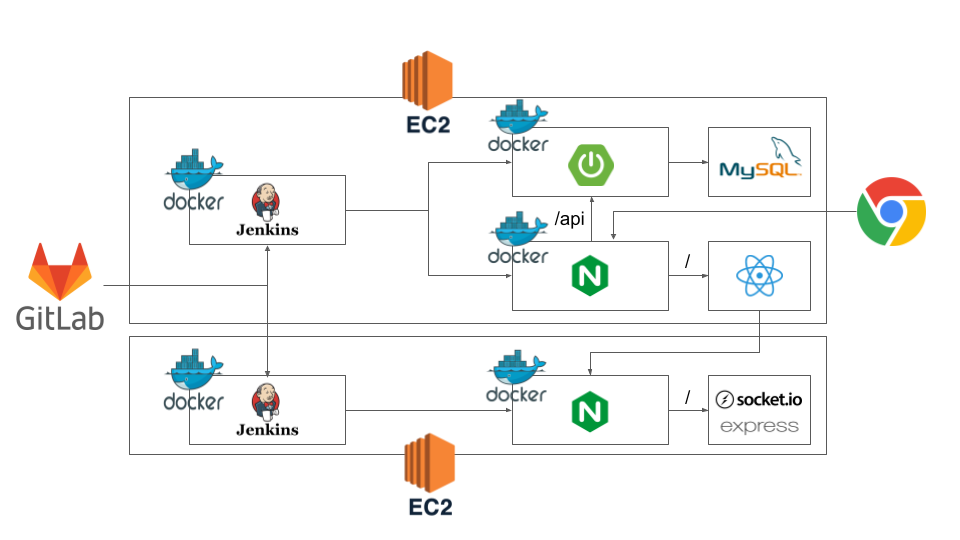

# 📚포팅 메뉴얼

## 📑목차

### [1. 기술 스택 & 버전 정보](#🛠기술-스택--버전-정보)

### [2. 빌드 방법](#⚙빌드-방법)

### [3. Docker & Jenkins](#🌞docker--jenkins)

### [4. 기타 설정](#기타-설정)

---

## 🛠기술 스택 & 버전 정보

### 1. 이슈관리


</br>

### 2. 형상관리


</br>

### 3. 커뮤니케이션

 

</br>

### 4. 개발 환경

#### **IDE**


#### **DB**


#### **UI/UX**


#### **Server**


</br>

### 5. 상세

#### **Backend**


#### **Frontend**


#### **WebRTC**


#### **CI/CD**


---
## ⚙빌드 방법

### ◼BE

1. **`back-server`** 프로젝트 열기
2. JDK 1.8 버전 확인
3. src/main/PochaApplication class 실행

### ◻FE

1. **`front-client`** 로 이동
2. npm install
3. npm start

### ◼RTC(Socket)

1. **`rtc-server`** 로 이동
2. npm install
3. npm run dev

---

 ## 🌞Docker & Jenkins



### 1. 서버 접속
```bash
# Window Terminal 사용
## - ssafy 제공 서버 : Frontend, Backend 서버
## - 개인 프리티어 서버 : WebRTC용 socekt 서버
ssh -i [키명.pem] ubuntu@[탄련적IP/도메인 주소]
```

### 2. 기본 설정
```bash
$ sudo apt install upgrade
$ sudo apt install update

# 방화벽 설정
$ sudo ufw allow 22 # ssh
$ sudo ufw allow 80 # http 
$ sudo ufw allow 443 # ssl
$ sudo ufw enable
# 상태 확인
$ sudo ufw status
```
### 3. Docker 설치
```bash
# 사전 패키지 설치
sudo apt update
sudo apt-get install -y ca-certificates \
    curl \
    software-properties-common \
    apt-transport-https \
    gnupg \
    lsb-release

# gpg 키 다운로드 : 프로그램 패키지가 유효한지 확인하기 위해 gpg키를 통해 검증
sudo mkdir -p /etc/apt/keyrings
curl -fsSL https://download.docker.com/linux/ubuntu/gpg | sudo gpg --dearmor -o /etc/apt/keyrings/docker.gpg

echo \
    "deb [arch=$(dpkg --print-architecture) signed-by=/etc/apt/keyrings/docker.gpg] https://download.docker.com/linux/ubuntu \
    $(lsb_release -cs) stable" | sudo tee /etc/apt/sources.list.d/docker.list > /dev/null

# Docker 설치
sudo apt update
sudo apt install docker-ce docker-ce-cli containerd.io docker-compose
```

### 4. 젠킨스 설치
#### 젠킨스 설치
- docker-copmpose.yml 생성 : vim 이용
```
version: '3'

services:
    jenkins:
        image: jenkins/jenkins:lts
        container_name: jenkins
        volumes:
            - /usr/bin/docker:/usr/bin/docker
            - /var/run/docker.sock:/var/run/docker.sock
            - /jenkins:/var/jenkins_home
            - /home/ubuntu/certbot:/var/certbot
        ports:
                - "9090:8080"
        privileged: true
        user: root
```
```bash
# ssl 설정
$ cd
$ sudo mkdir certbot
$ cd certbot
$ sudo mkdir conf www logs
$ sudo docker pull certbot/certbot
$ sudo docker run -it --rm --name certbot -p 80:80 -v "/home/ubuntu/certbot/conf:/etc/letsencrypt" -v "/home/ubuntu/certbot/log:/var/log/letsencrypt" -v "/home/ubuntu/certbot/www:/var/www/certbot" certbot/certbot certonly

# 컨테이너 생성
$ sudo docker-compose up -d

# 컨테이너 확인
$ sudo docker ps
```
#### 젠킨스 설정
```bash
# 젠킨스 Administrator password 확인
$ sudo docker logs jenkins

1. 서버 공인 IP:9090 => 젠킨스 접속
2. 관리자 접속(위의 패스워드 사용)
3. 기본 플러그인 자동 설치
4. 젠킨스 계정 생성
5. Jenkins 관리 -> 플러그인 관리 -> 설치 가능
6. gitlab 플러그인 설치 : GitLab, Generic Webhook Trigger, Gitlab API, GitLab Authentication
7. docker 플러그인 설치 : Docker, Docker Commons, Docker Pipeline, Docker API
8. SSH 플러그인 설치 : Publish OPver SSH
```
### 5. NGINX 설정
```bash
#######################################
# Frontend, Backend Server Config
map $http_upgrade $connection_upgrade {
    default upgrade;
    ''      close;
}

server {
    listen       80;
    listen  [::]:80;
    server_name  [공인 IP];

    location / {
        return 301 https://$host$request_uri;
    }
}
server{
    listen 443 ssl;
    listen [::]:443;

    server_name [공인 IP];
    
    access_log  /var/log/nginx/access.log;
    error_log  /var/log/nginx/error.log;

    ssl_certificate /etc/letsencrypt/live/i8e201.p.ssafy.io/fullchain.pem;
    ssl_certificate_key /etc/letsencrypt/live/i8e201.p.ssafy.io/privkey.pem;
    ssl_protocols TLSv1 TLSv1.1 TLSv1.2 SSLv3;
    ssl_ciphers ALL;


    location / {
        root /usr/share/nginx/html;
        index index.html index.htm;
        try_files $uri $uri/ /index.html;
    }

	location /api {
        proxy_pass http://[공인 IP]:9999;
        proxy_redirect off;
        proxy_set_header X-Real-IP $remote_addr;
        proxy_set_header X-Forwarded-For $proxy_add_x_forwarded_for;
    }

    error_page   500 502 503 504  /50x.html;
    location = /50x.html {
        root   /usr/share/nginx/html;
    }
}
#######################################

#######################################
# Socket(RTC) Server Config
server {
    listen       80;
    listen  [::]:80;
    server_name  [공인 IP];


    location / {
        return 301 https://$host$request_uri;
    }
}

server{
    listen 443 ssl;
    listen [::]:443;

    server_name [공인 IP];
    
    access_log  /var/log/nginx/access.log;
    error_log  /var/log/nginx/error.log;

    ssl_certificate /etc/letsencrypt/live/pocha.online/fullchain.pem;
    ssl_certificate_key /etc/letsencrypt/live/pocha.online/privkey.pem;
    ssl_protocols TLSv1 TLSv1.1 TLSv1.2 SSLv3;
    ssl_ciphers ALL;

    location / {
        proxy_pass http://[공인 IP]:4000;
        
        proxy_set_header   Host $host;
        proxy_set_header   X-Real-IP $remote_addr;
        proxy_set_header   X-Forwarded-For $proxy_add_x_forwarded_for;
        proxy_set_header Upgrade $http_upgrade;
        proxy_set_header Connection "upgrade";
    }

    error_page   500 502 503 504  /50x.html;
    location = /50x.html {
        root   /usr/share/nginx/html;
    }
}
#######################################
```

### 6. DockerFile 생성
#### Back-End
```bash
# **/back-server/DockerFile
FROM adoptopenjdk/openjdk8 AS builder
COPY gradlew .
COPY gradle gradle
COPY build.gradle .
COPY settings.gradle .
COPY src src
RUN chmod +x ./gradlew
RUN ./gradlew bootJAR

FROM adoptopenjdk/openjdk8
COPY --from=builder build/libs/*.jar app.jar
EXPOSE 10080
ENTRYPOINT ["java", "-jar", "/app.jar"]
```
#### Front-End
```bash
# **/front-clinet/DockerFile
FROM node:18.12.1 as build-stage
WORKDIR /var/jenkins_home/workspace/pocha_deploy/front-client
COPY package*.json ./
RUN npm install
COPY . .
RUN npm run build
FROM nginx:stable-alpine as production-stage

COPY --from=build-stage /var/jenkins_home/workspace/pocha_deploy/front-client/build /usr/share/nginx/html
COPY --from=build-stage /var/jenkins_home/workspace/pocha_deploy/front-client/deploy-conf/nginx.conf /etc/nginx/conf.d/default.conf
EXPOSE 80
CMD ["nginx", "-g","daemon off;"]
```
#### RTC(Socker ServeR)
```bash
# **/rtc-server/DockerFile
FROM node:18.12.1 as build-stage
WORKDIR /var/jenkins_home/workspace/deploytest/rtc-server
COPY package*.json ./
RUN npm install
COPY . .
CMD ["npm", "run", "dev"]
```
#### RTC - NGINX
```bash
# **/rtc-server/deploy_conf/DockerFile
FROM nginx:stable-alpine as production-stage

COPY ./nginx.conf /etc/nginx/conf.d/default.conf
EXPOSE 80
CMD ["nginx", "-g","daemon off;"]
```

### 7. Jenkins Shell Script
#### 1) EC2 : Front, Back
#### ◼Back-End
```bash
docker build -t backimg ./back-server
if (docker ps | grep "backimg"); then docker stop backimg; fi
docker run -it -d --rm -p 9999:9999 --name backimg backimg
echo "Run back-server"
```
#### ◼Front-End
```bash
docker build -t frontimg ./front-client
if (docker ps | grep "frontimg"); then docker stop frontimg; fi
docker run -it -d --rm -p 80:80 -p 443:443 -v /home/ubuntu/certbot/conf/letsencrypt:/etc/letsencrypt --name frontimg frontimg
echo "Run front-client"
```
#### 2) EC2 : RTC(Socker Server)
#### ◼ RTC(Socker ServeR)
```bash
docker build -t rtcimg ./rtc-server
if (docker ps | grep "rtcimg"); then docker stop rtcimg; fi
docker run -it -d --rm -p 4000:4000 --name rtcimg rtcimg
echo "Run rtc-server"
```
#### ◼ RTC - NGINX
```bash
docker build -t nginximg ./rtc-server/src/deploy_conf
if (docker ps | grep "nginximg"); then docker stop nginximg; fi
docker run -it -d --rm -p 80:80 -p 443:443 -v /home/ubuntu/certbot/conf:/etc/letsencrypt --name nginximg nginximg
echo "Run nginx"
```

## 기타 설정
### 1. DB : MySQL
> back-server/src/main/resources/application.properties
```bash
spring.datasource.driver-class-name=com.mysql.cj.jdbc.Driver
spring.datasource.url=jdbc:mysql://{Domain}:{Port}/{DB_Name}?serverTimezone=Asia/Seoul&zeroDateTimeBehavior=convertToNull
spring.datasource.username={username}
spring.datasource.password={password}
```

### 2. 네이버 로그인
> back-server/build.gradle
```bash
implementation 'org.springframework.boot:spring-boot-starter-oauth2-client'
```
> back-server/src/main/resources/application.properties
```bash
# naver OAuth
spring.security.oauth2.client.registration.naver.client-id={네이버 API Client Id}
spring.security.oauth2.client.registration.naver.client-secret={네이버 API Secret Code}
spring.security.oauth2.client.registration.naver.redirect-uri={Domain}:{Port}/login/oauth2/code/naver
spring.security.oauth2.client.registration.naver.scope=gender,birthday,birthyear
spring.security.oauth2.client.registration.naver.client-name=Naver
spring.security.oauth2.client.registration.naver.authorization-grant-type=authorization_code

# naver Provider
spring.security.oauth2.client.provider.naver.authorization-uri=https://nid.naver.com/oauth2.0/authorize
spring.security.oauth2.client.provider.naver.token-uri=https://nid.naver.com/oauth2.0/token
spring.security.oauth2.client.provider.naver.user-info-uri=https://openapi.naver.com/v1/nid/me
spring.security.oauth2.client.provider.naver.user-name-attribute=response
```